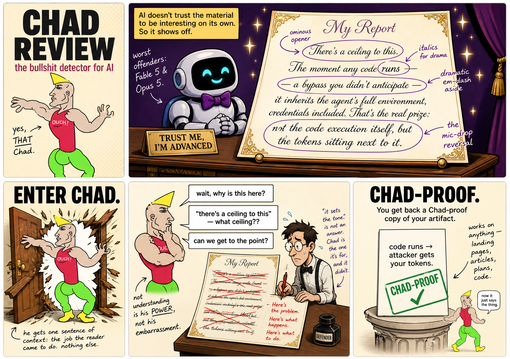

# Chad Review

A Claude Code plugin that strips the showing-off from AI-written text — code, a prompt, a doc, a landing page. It rewrites the fancy parts plain, shows you the rewrite, and touches your original only when you say so.



## Why

AI output pads the job with clever words, metaphors, and caveats nobody needed — because it doesn't trust the material to be interesting on its own. Chad is the reviewer who refuses to be impressed.


He meets your artifact the way a real user does — the whole thing first, in reading order, so "these three docs tell me the same thing" gets caught, then each file on its own — knowing only the job it's there to do, and leaves the dumb comments: "why is this here?", "why say it this fancy way?". A defender — who treats Chad as an asset, a bullshit detector running before the real world does — addresses every comment: fixes the file, or rejects the comment and tells Chad why. Then the same Chad re-reviews, round after round (default 3), until he's satisfied or the rounds run out.

## Install

In Claude Code:

```
/plugin marketplace add nityeshaga/claude-code-essentials
/plugin install chad-review@claude-code-essentials
```

## Use it

Ask Claude Code in plain words: "strip the showing-off from X", "make this plainer", "run Chad on this file". No command needed — phrases like these make Claude pick up the plugin by itself.

If the file's job isn't obvious, say it: "run Chad on README.md — its job is to get a stranger installed in a minute." Otherwise Claude works the job out from the file and your request.

You get back the full plainer rewrite of each file, the comment trail (every comment and what the defender did with it), and — first — any unresolved tensions: comments the defender rejected that Chad still stands by. You rule on those. Say "apply it" and Claude overwrites the file with the plain version — or gives you a diff, or a PR if you work in a git repo. Until then, nothing changes.

Internals and full input/output details: `skills/chad-review/SKILL.md`.

## Sibling

Chad rewrites what shows off. If your problem is extra content rather than fancy wording — whole sections that don't need to exist — use the **elon-algorithm** plugin instead. Chad strips the performance; Elon's algorithm deletes the bloat.
